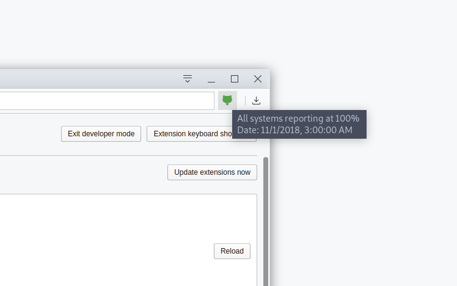
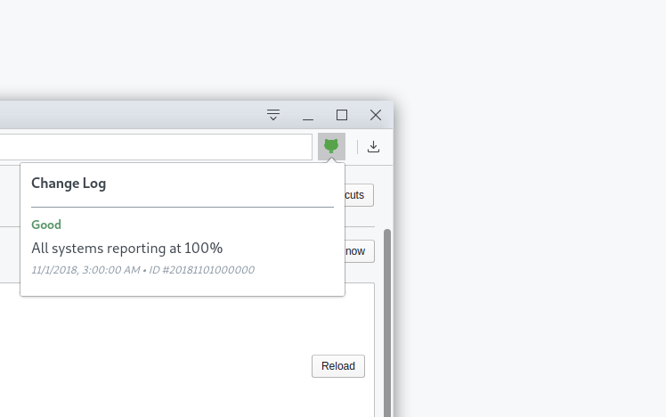

	
	 
	 
	<h4>Github Service Status Extension</h4>
	

		Stay on top of the status of github.com and its status messages.
	

	 
	 

 

## Preview
The extension fetches data from the official [rss channel](https://status.github.com/mesages.rss) of Guthub,
otherwise uses the index page of [status.github.com](https://status.github.com/mesages) as a source. The extension updates its state every minute.

## Github Issues

|Icon| Description|
|---|:---:|
|| Initial state of the extension. The extension has not yet got data from Github.
|| Github works without any issues
|| Some minor issue occurred.
|| Some major issue occurred.

## Collaboration

Please, feel free to ask any questions that you have about using and developing the extension.

---
Good luck.

